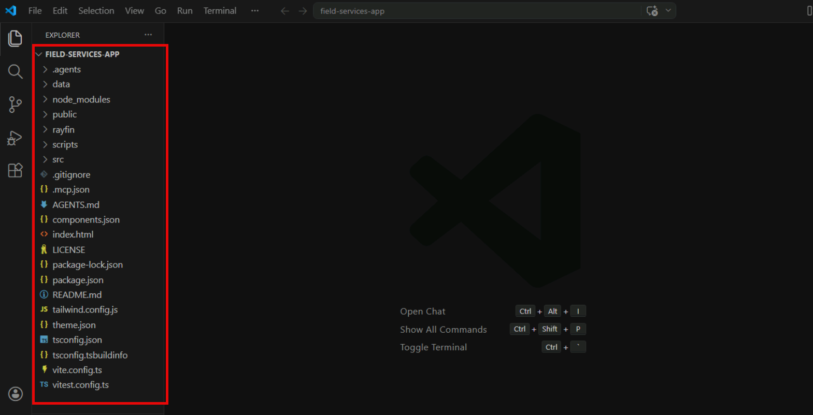

# Exercise 2: Bootstrap App from Template

In this exercise, you'll create a new Rayfin project from the **Field Services** template.

First, open the folder in VS code (do not go inside the repo folder when choosing it to open.)

The template handles the setup for you, so you can focus on the lab.
> [!TIP]
> On the left bar, you can now see all folders and files. The template is available locally inside  **.\template\field-services-app**. The **rayfin** CLI knows how to find it by name.

## Task 1: Bootstrap a new Rayfin project from the Field Services template

**This is the most important part of setting things up so please ensure you follow the instructions!** In the Terminal, type/add one of the following commands based on your Fabric environment, **replace** **< workspace-name >** with **exactly** the name of the workspace you chose in previous exercise (copy and paste it to be safe! it is case sensitive, no extra spaces, etc.)

If your workspace is in **MSIT**:

```shell 
npm create -y @microsoft/rayfin@latest -- --project-name field-services-app --template "./template/field-services-app" --workspace <workspace-name> --base-api-url https://msitapi.fabric.microsoft.com
```

If your workspace is in **DXT**:

```shell 
npm create -y @microsoft/rayfin@latest -- --project-name field-services-app --template "./template/field-services-app" --workspace <workspace-name> --base-api-url https://dxtapi.fabric.microsoft.com
```


After replacing with your workspace name in the URL, press enter, the CLI will then:

    - Create a new folder called **field-services-app** in your current directory.
    - Copy the template files into a new **field-services-app** folder.
    - Wire the project to your Fabric workspace using the `--workspace-id` you provided.
    - Run `npm install` in the new project folder to pull dependencies (this can take a couple of minutes on first run).

While the install is running, you can open the `data` folder at **.\template\field-services-app** to see the original prompt and dataset used to generate this template. This will give you a better understanding of how the app was built and ideas on how to customize it later in the lab.

## Task 2: Explore the generated project and make your first commit

In this task, you will inspect the generated project, initialize a Git repository, and make your first commit. This is important for GitHub Copilot CLI in later exercises, as it will show you clean diffs and what it will be changing when you ask it to generate code.

1. Open the **field-services-app** folder in Visual Studio Code by running the following command in the terminal:

    ```shell
    code field-services-app
    ```

1. In the pop-up dialog in Visual Studio Code that appears asking if you trust the authors, select **Yes, I trust the authors**.

1. In the Visual Studio Code Explorer, expand the **field-services-app** folder that was created by the bootstrap command.

    

1. Review the project structure. It should look something like this:

    - **src/**: React + TypeScript frontend
    - **rayfin/**: Rayfin backend configuration (*rayfin.yml*, data entities)
    - **data/**: Seed data and **the original prompt + dataset used to generate this template** (worth a look if you're curious how it was built)
    - **package.json**: Dependencies and scripts for the project, including **build** and **dev**.

1. Open the terminal in Visual Studio Code by selecting **View > Terminal** from the top menu.

1. In the Visual Studio Code terminal, run this command to initialize a new Git repository:

    ```shell
    git init
    ```

1. Next, add all the files to the staging area with this command:

    ```shell
    git add .
    ```

1. Finally, make your first commit with this command:

    ```shell
    git commit -m "Initial commit - bootstrap from template"
    ```

Continue to the next exercise to explore the codebase.
